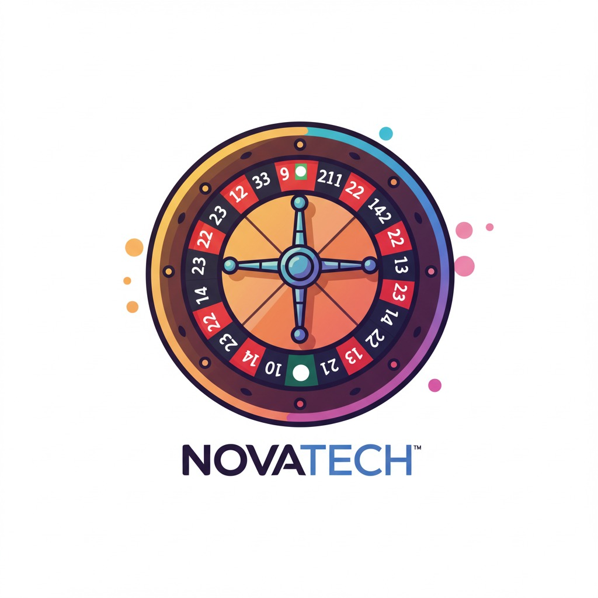

# 
NovaTech - NVT - 2025.01

# 
Projeto para a matéria de Desenvolvimento Ágil do primeiro semestre de 2025 (2025.1)

 <figure>
  
   
  <figcaption>Logo inicial do website</figcaption>
 </figure>

 

 # Integrantes do grupo:  
<markdown-accessiblity-table data-catalyst=""><table tabindex="0">
<thead>
  <tr>
    <th align="center"><a href="https://github.com/Luis-Spessoto"> Luís Felipe Spessoto</a></th>
    <th align="center"><a href="https://github.com/BrunoBiazon"> Bruno Circhia Biazon</a></th>
    <th align="center"><a href="https://github.com/JoaoVFB"> João Vitor</a></th>
   <th align="center"><a href="https://github.com/DaniloFrazon"> Danilo</a></th>
   <th align="center"><a href="https://github.com/Pedro-Meloo">  Pedro </a></th>
   <th align="center"><a href="https://github.com/rdgcamara">  Rodrigo </a></th>
    </tr>
</thead>
</table></markdown-accessiblity-table>

# Descrição do projeto
Nosso grupo desenvolverá um website que mostrará ao usuário uma roleta, onde a partir dela será possível decidir um número e uma cor (preto ou vermelho) aleatória junto de um valor fictício de aposta. Caso o valor e a cor gerados aleatoriamentes sejam iguais aos escolhidos pelo usuário, seu valor, fictício, será dobrado ou zerado. Caso o usuário não queira realizar uma aposta, será possível apenas utilizar a roleta como forma de sortear um valor aleatório

# Navegação
<ul>
  <li><a href="Requisitos de Usuário/RF.md">Requisitos Funcionais</a></li>
  <li><a href="Requisitos de Usuário/RNF.md">Requisitos Não Funcionais</a></li>
  <li><a href="Histórias de Usuários/HistoriasUsuario.md">Histórias de Usuários</a></li>
</ul>
